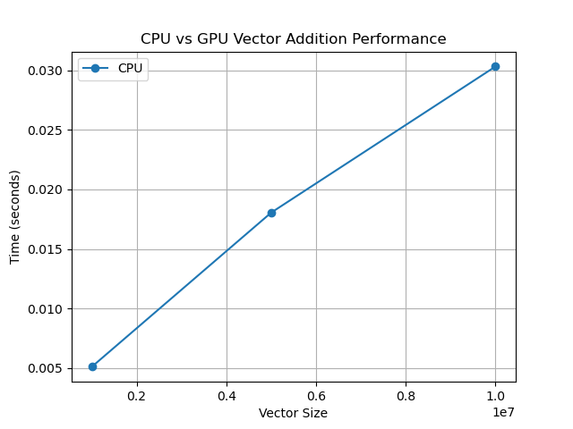

# GPU Portfolio Project: Vector Addition Benchmark

## Overview

This repository demonstrates a reproducible GPU computing workflow using
NumPy (CPU) and CuPy (GPU) to benchmark vector addition performance.

The project is designed as a **portfolio-grade GPU systems project**, 
showcasing:

- GPU acceleration principles
- Performance benchmarking methodology
- Reproducible environments (Conda, Docker)
- Automated execution (CI-ready)
- PDF reporting with GPU environment metadata

The code runs correctly on systems **with or without a GPU**, using
automatic CPU fallback when needed.

---

## Objectives

- Compare CPU and GPU execution time for data-parallel workloads
- Demonstrate when GPU acceleration is beneficial
- Build a professional, reproducible GPU experiment pipeline
- Practice real-world tooling used in ML and HPC projects

---

## Methodology

1. Generate large random vectors
2. Perform element-wise vector addition on:
   - CPU using NumPy
   - GPU using CuPy (if available)
3. Measure execution time with synchronization
4. Compute speedup and analyze performance behavior
5. Automate execution via scripts and CI-compatible tooling
6. Collect GPU environment metadata for reproducibility
7. Generate PDF report including performance plots and GPU info

---

## Key Findings

- For moderate vector sizes, CPU performance may match or exceed GPU
- GPU benefits appear when workloads are large enough to amortize:
  - Kernel launch overhead
  - Host–device memory transfer costs
- GPU metadata shows device name, CUDA version, and CuPy version used
- PDF report demonstrates performance trends professionally

---

## Repository Structure

```text
gpu-portfolio/
├── notebooks/
│   └── vector_addition.ipynb       # Main experiment notebook
├── performance/
│   ├── benchmark_vector_add.py     # CPU/GPU benchmark script
│   ├── gpu_info.py                 # Collect GPU metadata
│   ├── plot_performance.py         # Performance visualization
│   ├── performance_results.txt     # Generated benchmark data
│   └── gpu_metadata.json           # GPU metadata (JSON)
├── reports/
│   ├── performance_report.pdf      # Generated PDF report
│   ├── generate_report.py          # Script to generate PDF report
│   └── figures/                    # Generated plots (PNG)
├── environment.yml                 # Conda environment definition
├── Dockerfile                      # GPU-enabled Docker environment
├── scripts/
│   └── run_notebooks.sh            # Automated notebook execution
├── tests/                          # Unit tests (pytest)
│   └── test_performance.py         # Verify performance scripts and GPU metadata
├── .github/workflows/
│   └── gpu-ci.yml                  # CI workflow
└── README.md
````

---

## Quickstart

### Option 1: Docker (Recommended)

#### Requirements

* NVIDIA GPU
* NVIDIA driver installed
* Docker + NVIDIA Container Toolkit

#### Build Docker image

```bash
docker build -t gpu-portfolio .
```

#### Run container

```bash
docker run --gpus all -it -p 8888:8888 gpu-portfolio
```

Copy the Jupyter URL with the token from the terminal and open it in a browser.

Inside the container, notebooks are under `/workspace/notebooks/`.

---

### Option 2: Conda (Local)

```bash
conda env create -f environment.yml
conda activate gpu-portfolio
jupyter notebook
```

---

## Notebook Execution (Automated)

To execute notebooks, generate performance plots, and verify results non-interactively:

```bash
bash run_notebooks.sh
```

This ensures:

* Correct kernel usage (`gpu-portfolio`)
* CI/Docker compatibility
* Reproducible execution
* GPU metadata collection
* PDF report generation
* Unit tests verify scripts, benchmark results, and GPU metadata

---

## Performance Results

The following figure shows CPU vs GPU execution time for vector addition
across increasing vector sizes.

<p align="center">
  
</p>

**Interpretation**

GPU acceleration does not necessarily outperform CPU for moderate or
memory-bound workloads. Kernel launch overhead and host–device data
transfer costs can dominate execution time.

As workload size increases, GPU performance advantages emerge once
computation is sufficient to amortize these overheads. This behavior
reflects a fundamental principle of GPU performance engineering.

**PDF Report Contents**

The generated PDF (`reports/performance_report.pdf`) includes:

- CPU vs GPU performance figure
- GPU metadata (device name, memory, CUDA version)
- Summary and interpretation of results
- Verification status from unit tests

---

## Performance Analysis

Performance is summarized in `reports/performance_report.pdf` and includes:

* CPU vs GPU execution times
* Performance plots
* GPU environment metadata (device name, CUDA version, CuPy version)

Key factors affecting performance:

* Problem size
* Memory bandwidth
* Kernel launch overhead
* Host–device transfer cost

Designing GPU workloads requires careful scaling analysis.

---

## Notes

* The project runs safely on CPU-only systems
* GPU detection is automatic
* All components are CI-ready and Docker-compatible
* Figures are saved as PNGs under `reports/figures/`
* PDF report provides a professional summary suitable for portfolio submission
* Unit tests verify scripts, benchmark results, and GPU metadata


